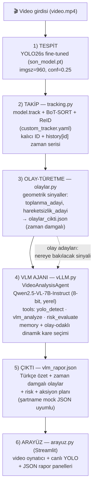

# The Deep — Video Analiz ve Karar Destek Sistemi

**BilisimVadisi2026** · **Türkiye Açık Kaynak Platformu**

[](LICENSE)
[](https://www.teknofest.org)
[](#)
[-green.svg)](#)

> **TEKNOFEST 2026 Yapay Zeka Dil Ajanları Yarışması — 3. Senaryo** (Bilişim Vadisi yürütücülüğünde)
> Takım: **The Deep** · Lisans: **Apache License 2.0**

Bu depo, TEKNOFEST 2026 Yapay Zeka Dil Ajanları Yarışması kapsamında **BilisimVadisi2026** etiketiyle yüklenmiş olup, yarışma bitiş tarihinde **Türkiye Açık Kaynak Platformu** GitHub hesabında **Apache License 2.0** ile paylaşılacaktır. Projedeki tüm kod, model ve dokümantasyon açık kaynaktır ve tamamen yerel (offline) çalışır.

---

## İçindekiler

- [Proje Özeti](#proje-özeti)
- [Sistem Mimarisi](#sistem-mimarisi)
- [Agentic Mimari](#agentic-mimari)
- [İmplemente Edilen Senaryolar ve Mock Fonksiyonlar](#i̇mplemente-edilen-senaryolar-ve-mock-fonksiyonlar)
- [Kurulum](#kurulum)
- [Çalıştırma](#çalıştırma)
- [Çıktı Formatları](#çıktı-formatları)
- [Ölçümleme ve KPI](#ölçümleme-ve-kpi)
- [Veri Setleri](#veri-setleri)
- [Karşılaşılan Zorluklar ve Çözümler](#karşılaşılan-zorluklar-ve-çözümler)
- [Bilinen Kısıtlar ve Yol Haritası](#bilinen-kısıtlar-ve-yol-haritası)
- [Ekip](#ekip)
- [Lisans](#lisans)
- [Repo Yapısı](#repo-yapısı)

---

## Proje Özeti

Savunma sanayi tesisleri, güvenlik sistemleri ve saha operasyonlarındaki kamera sistemleri sürekli ve yüksek hacimli video verisi üretir; bu verinin manuel analizi hem zaman maliyetlidir hem de insan hatasına açıktır. **The Deep**, şartnamenin 3. Senaryo problem tanımına birebir karşılık gelen bir çözümdür: sisteme bir **video girdisi** yüklenir; sistem video içeriğini analiz eder, **olayları, kişileri ve riskli durumları tespit eder**, kritik anları **zaman damgası** ile belirler, videonun **kısa ve anlaşılır Türkçe özetini** üretir, **risk değerlendirmesi** yapar ve operatöre **uygulanabilir aksiyon önerileri** sunar. Tüm çıktılar hem insan tarafından okunabilir hem de makine tarafından işlenebilir **yapılandırılmış JSON** formatındadır.

Sistem iki seviyeli bir zekâ köprüsü kurar: düşük seviyeli algı katmanı (fine-tune edilmiş **YOLO26s** nesne tespiti + **BoT-SORT** çoklu nesne takibi) sahnedeki nesneleri kalıcı kimliklerle izleyip zaman damgalı **olay adayları** üretir; yüksek seviyeli çıkarım katmanı (**Qwen2.5-VL-7B-Instruct** multimodal dil modeli üzerine kurulu **VideoAnalysisAgent** ajanı) bu adayların işaret ettiği kareleri görsel olarak yorumlar, olayın türünü, önemini ve olası etkilerini değerlendirir, Türkçe doğal dilde özet ve aksiyon planı üretir. Bu tasarım, şartnamenin "düşük seviyeli algı ile yüksek seviyeli çıkarım arasında köprü" beklentisinin doğrudan implementasyonudur.

Sistem **tamamen yerel ve offline** çalışır: hiçbir dış API, kapalı servis veya bulut bağımlılığı yoktur. VLM yerel olarak 8-bit nicemleme ile servislenmiştir (tek GPU'da, 16 GB VRAM); tespit modeli 19 MB'lık `son_model.pt` olarak depoda teslim edilir. Çözüm statik kural tabanlı bir pipeline değil, **model tabanlı, araç çağrılı (tool-calling), bellekli (memory) ve dinamik kare seçimli agentic bir mimaridir** — detaylar [Agentic Mimari](#agentic-mimari) bölümündedir.

---

## Sistem Mimarisi



### Katmanların anlatımı

**1) Tespit — YOLO26s (fine-tuned).** COCO-pretrained YOLO26s, saha senaryosuna özel sınıflara fine-tune edildi (`son_model.pt`, validasyon mAP50 **0.877**). Çıkarım `imgsz=960, conf=0.25` ile çalışır; kare başına ~9 ms sürer (ultralytics dahili ölçümü, RTX 5080 Laptop — `degerlendirme.py` ile yeniden ölçülebilir).

**2) Takip — `tracking.py`.** `model.track(persist=True)` üzerine **BoT-SORT + ReID** (uzun buffer, `custom_tracker.yaml`) ile her nesneye kalıcı kimlik atanır ve `history[id] = [{frame, t, cls, cx, cy, w, h}, ...]` zaman serisi tutulur. Kısa (gürültü) track'ler `MIN_TRACK=30` eşiğiyle elenir.

**3) Olay-türetme — `olaylar.py`.** Track zaman serilerinden güvenilir geometrik sinyaller üretilir: `toplanma_adayi` (aynı anda ≥3 kişinin merkezleri yakın) ve `hareketsizlik_adayi` (bir kişinin merkezi ~2,5 sn sabit). Her sinyal zaman damgalıdır (`frame / fps`) ve `olaylar_cikti.json` olarak yazılır. Bu katman yalnızca **"nereye bak" sinyali** üretir; anlamlandırma yapmaz.

**4) VLM ajanı — `vLLM.py`.** `VideoAnalysisAgent`, `olaylar_cikti.json`'daki olay adaylarının zamanlarına odaklanarak kareleri seçer, her karede üç aracını (`yolo_detect`, `vlm_analyze`, `risk_evaluate`) zincirler, kare analizlerini belleğinde biriktirir ve **"ne oldu, risk ne, ne yapılmalı"** kararını Türkçe üretir. Devrilme ve baretsizlik gibi görsel-anlamsal tespitler bilinçli olarak bu katmana devredilmiştir (bkz. [Zorluklar](#karşılaşılan-zorluklar-ve-çözümler)).

**5) Çıktı — Türkçe nihai rapor.** Ajan belleğindeki kare analizleri birleştirilip `vlm_rapor.json` üretilir: video özeti, genel risk seviyesi, zaman damgalı olay listesi ve genel aksiyon planı. Rapor, şartnamenin mock JSON formatına birebir uyumlu bir `sartname_json` bloğu da içerir.

**6) Arayüz — `arayuz.py` (Streamlit).** Video oynatıcı, canlı YOLO tespit görselleştirmesi ve JSON rapor panellerini tek ekranda sunan yerel web arayüzü. Operatör videoyu yükler, analiz zincirini başlatır ve zaman damgalı olayları/aksiyon önerilerini takip eder.

---

## Agentic Mimari

> Şartname değerlendirmesinin **%35'i** "Teknik İmplementasyon ve Mimari" — yani agent, tools, memory ve prompt engineering bileşenlerinin etkin kullanımı. Şartname ayrıca açıkça belirtir: *"Statik, yalnızca kural tabanlı çözümler düşük puanlanacaktır."* The Deep bu maddeye karşı bilinçli konumlanmıştır: sabit eşiklerle karar veren bir pipeline **değil**, model tabanlı karar mekanizmalı, bağlama göre farklı çıktılar üreten bir ajan mimarisidir.

### Agent — `VideoAnalysisAgent` (`vLLM.py`)

Videoyu uçtan uca yöneten ajan sınıfı. Her hedef karede algı → yorum → risk zincirini kurar, sonuçları belleğine yazar ve video bittiğinde bellekten bütünsel bir Türkçe rapor sentezler. Karar akışı LLM tabanlıdır: hangi sahnenin riskli olduğu, hangi aksiyonların önerileceği kurallarla değil, multimodal modelin görsel akıl yürütmesiyle belirlenir.

### Tools — üç araçlı zincir

| Araç | Görev | Model tabanı |
|---|---|---|
| `yolo_detect` | Karedeki nesneleri (sınıf, güven, bbox) çıkarır; VLM'e yapılandırılmış algı bağlamı sağlar | YOLO26s fine-tuned (`son_model.pt`) |
| `vlm_analyze` | Kareyi + YOLO tespitlerini + zaman damgasını alır; olay türü, Türkçe yorum, risk skoru (1-10), acil müdahale bayrağı ve aksiyon planını JSON olarak üretir | Qwen2.5-VL-7B-Instruct (8-bit, yerel) |
| `risk_evaluate` | VLM'in risk skorunu operasyonel seviyeye (KRİTİK/ORTA/DÜŞÜK) ve alarm bayrağına dönüştürür | Kural + eşik (yorumlanabilirlik için) |

Araçlar ajan tarafından **her kare için dinamik olarak zincirlenir**: `yolo_detect` çıktısı `vlm_analyze` girdisine, onun çıktısı `risk_evaluate` girdisine akar. VLM, YOLO listesini "körü körüne" doğru kabul etmez — sistem promptu, tehlikeyi yalnızca **görsel kanıtla** puanlamasını zorunlu kılar (yanlış alarm ile kaçırılmış olay arasındaki dengeyi model kurar).

### Memory — kare analizlerinin birikimi

Ajan, her başarılı kare analizini `self.memory` listesine ekler: `{timestamp, olay_turu, olay_yorumu, risk_skoru, acil_mudahale, aksiyon_plani}`. Nihai rapor bu bellekten sentezlenir: en yüksek riskli olay genel risk seviyesini belirler, `acil_mudahale=true` olan kayıtlar kritik olay sayısını verir, aksiyon planları **yalnızca risk ≥ 4 olaylardan** toplanır ve `difflib` tabanlı benzerlik eleme ile yakın-tekrar öneriler ayıklanır. Böylece rapor tek karelik bir bakış değil, videonun **zamansal bütününün** özetidir.

### Prompt Engineering — dört savunma hattı

1. **JSON ön-doldurma (prefill):** Asistan cevabı `"{"` karakteriyle önceden başlatılır; model düz metinle söze giremez, JSON şemasının içinden devam etmek zorunda kalır.
2. **Few-shot Türkçe örnek:** Sistem promptunda doldurulmuş, tamamen Türkçe bir örnek çıktı yer alır; anahtar adları ve değer dili örnekle sabitlenir.
3. **Dil bekçisi:** Üretilen JSON değerlerinde bariz İngilizce kalıplar (regex ile `the/is/are/worker/ensure...`) taranır; yakalanırsa üretim geçersiz sayılır.
4. **2-deneme düzeltme döngüsü:** JSON parse edilemezse veya dil bekçisi takılırsa, "Önceki cevap geçersizdi, SADECE şemadaki JSON'u tamamen Türkçe üret" uyarısıyla bir kez daha denenir. Ayrıca greedy decoding (`do_sample=False`) + `repetition_penalty=1.05` ile determinizm ve tekrarsızlık sağlanır; `risk_skoru` güvenli biçimde `int`'e zorlanır.

### Dinamik olay-odaklı kare seçimi — statik pipeline DEĞİL

Ajan kareleri **sabit aralıkla örneklemez**. Vision katmanının ürettiği `olaylar_cikti.json` mevcutsa, ajan **yalnızca olay adaylarının zamanlarına** bakar (her aday için `t` ve olayın gelişimini görmek üzere `t + 1,5 sn`). Yani videonun içeriği ajanın nereye bakacağını **çalışma anında** belirler: olaysız bir videoda birkaç kare, olay yoğun bir videoda o olayların etrafında yoğunlaşmış kareler analiz edilir. `olaylar_cikti.json` yoksa ajan süreye orantılı örneklemeye (5 sn'de 1 kare, tavan `max_kare=32`) **kendisi geri düşer** — bu da hata toleransı ve bağlam yönetimi örneğidir. Bu tasarım, şartnamenin "dinamik analiz yapabilen, bağlama göre farklı çıktılar üretebilen, model tabanlı karar mekanizmaları içeren mimari" beklentisinin doğrudan karşılığıdır.

### Model servisleme — yerel ve offline

Şartname "vLLM **veya benzeri** yüksek performanslı yerel servisleme altyapısı" ister. Mevcut sürümde Qwen2.5-VL-7B, **8-bit nicemleme** (bitsandbytes) ile **süreç içinde, tamamen yerel** servislenir: ilk çalıştırmada model bir kez `./lokal_qwen_8bit/` klasörüne kaydedilir, sonraki tüm yüklemeler **çevrimdışıdır**; tek GPU'da (16 GB VRAM) düşük gecikmeli çıkarım sağlanır ve hiçbir dış API/bulut bağımlılığı yoktur. `vLLM.py` dosya adı, katmanın hedef servisleme altyapısına atıftır; **vLLM sunucusuna geçiş** (PagedAttention, sürekli batching, çok istemcili servis) [yol haritasında](#bilinen-kısıtlar-ve-yol-haritası) planlı ölçekleme adımıdır — mevcut süreç-içi yaklaşım, tek-operatör senaryosunun gereksinimini offline ve verimli biçimde karşılamaktadır.

---

## İmplemente Edilen Senaryolar ve Mock Fonksiyonlar

**Senaryo kapsamı:** Şartnamenin 3. Senaryosu **uçtan uca implemente edilmiştir** — video yükleme → olayların zaman damgalı listelenmesi → genel Türkçe video özeti → risk değerlendirmesi → aksiyon önerileri → yapılandırılmış JSON çıktı (şartnamedeki senaryo örneğindeki "forklift devrilmesi / yerde hareketsiz kişi / personel toplanması" olay ailesi hedeflenmiştir; toplanma ve hareketsizlik geometrik sinyalle, devrilme VLM'in görsel yorumuyla ele alınır).

**Mock fonksiyonlar → gerçek model tabanlı araçlar:** Şartnamedeki "mock fonksiyonların ajanın araçları olarak kullanılması" beklentisi, bu projede mock yerine **gerçek modellerle çalışan üç araçla** karşılanmıştır: `yolo_detect` (YOLO26s tespit), `vlm_analyze` (Qwen2.5-VL görsel analiz) ve `risk_evaluate` (risk seviyelendirme). Ajan bu araçları her karede dinamik olarak zincirler ([Agentic Mimari](#agentic-mimari)); araç arayüzleri mock-uyumludur — yani jüri değerlendirmesinde araçlardan herhangi biri sahte/mock implementasyonla değiştirilse ajan akışı aynen çalışır. Nihai çıktının `sartname_json` bloğu, şartnamenin 5. bölümdeki mock JSON örneğiyle **birebir aynı anahtarları** üretir.

---

## Kurulum

Adımlar Windows (PowerShell) odaklı yazılmıştır; Linux/macOS için eşdeğer komutlar parantez içinde verilmiştir.

### 1) Depoyu klonlayın

```powershell
git clone https://github.com/Emir-Gemici/The_Deep.git
cd The_Deep
```

### 2) Sanal ortam oluşturup etkinleştirin

```powershell
python -m venv .venv
.\.venv\Scripts\Activate.ps1        # (Linux/macOS: source .venv/bin/activate)
```

### 3) PyTorch'u CUDA 12.8 index'i ile kurun (ÖNCE bu!)

PyTorch'un CUDA sürümü özel paket index'i gerektirir; `requirements.txt`'ten önce kurulmalıdır:

```powershell
pip install torch torchvision --index-url https://download.pytorch.org/whl/cu128
```

> GPU'suz (CPU-only) denemek için index satırını atlayıp `pip install torch torchvision` kullanabilirsiniz; ancak VLM katmanı pratikte GPU gerektirir.

### 4) Temel bağımlılıkları kurun

```powershell
pip install -r requirements.txt
```

Temel paketler (tespit + takip + olay-türetme + arayüz): `ultralytics==8.4.72`, `opencv-python==4.13.0.92`, `numpy==2.4.6`, `pillow==12.2.0`, `lap==0.5.13`, `pyyaml==6.0.3`, `streamlit==1.58.0`.

### 5) VLM ekstralarını kurun (ajan katmanı için)

`requirements.txt` içindeki yorumlu "VLM ekstraları" bölümü, yalnızca `vLLM.py` (VLM ajanı) çalıştırılacaksa gereklidir:

```powershell
pip install "transformers>=4.49" qwen-vl-utils accelerate bitsandbytes
```

> `transformers>=4.49` Qwen2.5-VL mimari desteği için gereklidir; `bitsandbytes` 8-bit nicemleme sağlar (16 GB VRAM'e sığar). İlk çalıştırmada model bir kez indirilip `./lokal_qwen_8bit/` klasörüne 8-bit olarak kaydedilir; sonraki tüm çalıştırmalar **tamamen çevrimdışıdır**.

### 6) Model dosyası

Fine-tune edilmiş tespit modeli **`son_model.pt` (19 MB) depoda hazır olarak yer alır** — ek indirme gerekmez.

---

## Çalıştırma

Aşağıdaki komutlar depo kök dizininde, sanal ortam aktifken çalıştırılır (`python` yerine `.\.venv\Scripts\python.exe` de kullanılabilir).

### Uçtan uca akış sırası

```
1. python olaylar.py Test.mp4      →  olaylar_cikti.json   (zaman damgalı olay adayları)
2. python vLLM.py Test.mp4         →  vlm_rapor.json       (Türkçe nihai rapor — ajanı çalıştırır)
3. streamlit run arayuz.py         →  http://localhost:8501 (video + canlı YOLO + JSON panelleri)
```

### Bileşen bileşen

| Komut | Ne yapar | Çıktı |
|---|---|---|
| `python olaylar.py <video>` | Takip + geometrik olay-türetme | `olaylar_cikti.json` |
| `python tracking.py <video>` | Kalıcı ID'li takip görselleştirmesi | ekranda kutu + ID |
| `python demo.py <video>` | Kutu + ID + olay banner'lı demo videosu üretir | `demo_<video>.mp4` |
| `python vLLM.py [video] [--max-kare N] [--olay-json D]` | VLM ajanını çalıştırır (olay-odaklı kare analizi + Türkçe rapor) | `vlm_rapor.json` |
| `python degerlendirme.py` | Benchmark: sınıf bazlı mAP + gerçek görsel testi + hız ölçümü | konsol raporu + anotasyonlu görseller |
| `streamlit run arayuz.py` | Yerel web arayüzü (video oynatıcı + canlı YOLO + JSON panelleri) | tarayıcıda UI |
| `python Foto.py` / `python Video.py` / `python Webcam.py` | Tek görsel / video / canlı kamera üzerinde basit tespit çıkarımı | ekranda tespitler |

> `vLLM.py` argümansız çalıştırıldığında varsayılan olarak `Test.mp4` ve `olaylar_cikti.json` dosyalarını okur; hızlı test için `python vLLM.py video.mp4 --max-kare 5` kullanın.

---

## Çıktı Formatları

### 1) `olaylar_cikti.json` — Vision → VLM arayüz sözleşmesi

`olaylar.py` yazar, `vLLM.py` okur. Gerçek örnek (bu depodaki `olaylar_cikti.json`'dan kısaltılmış):

```json
{
  "video": "Test.mp4",
  "track_sayisi": 108,
  "olay_adaylari": [
    { "t": "00:39", "saniye": 39.0, "tip": "toplanma_adayi",
      "objeler": ["insan#51", "insan#76", "insan#84"], "detay": "3 kisi yakin" },
    { "t": "00:41", "saniye": 41.7, "tip": "hareketsizlik_adayi",
      "obje": "insan#94", "detay": "~2.5sn hareketsiz" }
  ]
}
```

- `tip` ∈ `{toplanma_adayi, hareketsizlik_adayi}` — güvenilir geometrik sinyaller
- `t` insan-okunur zaman damgası, `saniye` sayısal karşılığı

### 2) `vlm_rapor.json` — VLM → Arayüz sözleşmesi

**`vLLM.py` yazar, `arayuz.py` okur — İKİSİ DE bu şemaya uymalıdır:**

```json
{
  "video": "Test.mp4",
  "kare_analizleri": [
    { "timestamp": "00:15", "olay_turu": "...", "olay_yorumu": "...",
      "risk_skoru": 8, "acil_mudahale": true, "aksiyon_plani": ["..."] }
  ],
  "rapor": {
    "video_ozeti": "...",
    "genel_risk": "Yüksek",
    "kritik_olay_sayisi": 1,
    "tespit_edilen_olaylar": [
      { "zaman": "00:15", "olay": "...", "risk_skoru": 8 }
    ],
    "genel_aksiyon_plani": ["..."]
  },
  "sartname_json": {
    "summary": "...",
    "events": [ { "time": "00:15", "event": "..." } ],
    "risk": "Yüksek",
    "actions": ["..."]
  }
}
```

- `kare_analizleri`: ajanın **memory** içeriği (kare kare analiz kaydı — açıklanabilirlik)
- `rapor`: ajanın sentezlediği bütünsel Türkçe rapor
- `sartname_json`: **şartnamenin mock JSON formatına birebir uyumlu** nihai blok

### 3) Şartname mock JSON uyumu

Şartnamenin 5. bölümündeki örnek format ile `sartname_json` bloğu alan alan eşleşir:

```json
{
  "summary": "Videoda forklift kazası ve yaralanma riski gözlenmiştir.",
  "events": [
    { "time": "00:15", "event": "Forklift devrildi" },
    { "time": "00:20", "event": "Yerde hareketsiz kişi" }
  ],
  "risk": "Yüksek",
  "actions": ["Sağlık ekibini çağır", "Alanı güvenlik altına al"]
}
```

---

## Ölçümleme ve KPI

### Tespit modeli doğruluğu (validasyon, mAP50)

`son_model.pt` — YOLO26s fine-tune, 5 sınıf; eğitim: RTX 5080 Laptop 16 GB, 100 epoch, ~6,8 saat; veri: train 18.004 / valid 3.516 / test 2.267 görsel.

| Sınıf | mAP50 |
|---|---|
| forklift | **0.982** |
| insan | **0.927** |
| yelek | 0.881 |
| baret | 0.836 |
| palet | 0.759 |
| **Genel** | **0.877** |

### Tanımlı KPI'lar

| KPI | Tanım | Mevcut durum |
|---|---|---|
| Olay yakalama oranı | Vision katmanının ürettiği olay adaylarının, videodaki gerçek kritik anları kapsama oranı | Tek test videosunda **manuel kontrole göre** toplanma + hareketsizlik adayları zaman damgalı yakalandı (11 aday / 108 track); çoklu-video ground-truth ölçümü planlı |
| Türkçe özet kalitesi | Nihai raporun tamamen Türkçe, şema-uyumlu ve tekrarsız olması | Dil bekçisi + 2-deneme döngüsü ile JSON geçerlilik ve Türkçe zorunluluğu güvence altında |
| YOLO çıkarım süresi | Kare başına tespit süresi (imgsz=960, RTX 5080 Laptop) | **~9 ms/kare** (ultralytics dahili ölçümü; `python degerlendirme.py` ile tekrarlanabilir) |
| Uçtan uca işleme süresi | Video yükleme → nihai JSON rapor toplam süresi | Olay-odaklı kare seçimi sayesinde VLM çağrı sayısı videodaki olay sayısıyla ölçeklenir (sabit örneklemeye göre büyük tasarruf); sayısal uçtan uca ölçüm çoklu-video kıyaslamasıyla raporlanacak |
| Aksiyon önerisi kalitesi | Önerilerin eyleme dönük, tekrarsız ve risk seviyesiyle tutarlı olması | Yakın-tekrar eleme (`difflib` ≥ 0,8) + yalnızca risk ≥ 4 olaylardan aksiyon toplama |

### Ölçekleme ihtiyaçları

- **GPU:** Mevcut kurulum tek GPU (16 GB VRAM, 8-bit Qwen2.5-VL-7B). Daha yüksek eşzamanlılık için 24 GB+ VRAM veya çoklu GPU önerilir; tespit katmanı CPU'da da çalışabilir.
- **vLLM servisleme:** Mevcut sürüm modeli transformers + bitsandbytes ile process içi servisliyor. Ölçekte, Qwen2.5-VL'nin **vLLM sunucusu** (PagedAttention, sürekli batching) arkasında servislenmesi planlanmaktadır — çok istemcili, düşük gecikmeli çıkarım için.
- **Çoklu kamera:** Vision katmanı (tespit + takip + olay-türetme) kamera başına bağımsız süreç olarak yatay ölçeklenir; olay adayları tek VLM servis kuyruğunda toplanır. Olay-odaklı kare seçimi burada kritik avantajdır: VLM yükü kamera sayısıyla değil, **olay sayısıyla** büyür.
- **Bellek:** 18k görsellik eğitimde `cache=ram` 74 GB'a ulaşıp taşma yaşattı; `cache=disk` ile çözüldü (bkz. Zorluklar). Çıkarım tarafında bellek ayak izi düşüktür (YOLO ~19 MB model + 8-bit VLM ~9 GB VRAM).

---

## Veri Setleri

Şartname gereği, kullanılan tüm veri setlerinin **herkese açık indirme bağlantıları** aşağıdadır:

| Veri seti | Kullanım amacı | Bağlantı | Lisans |
|---|---|---|---|
| Forklift (Mohamed Traore) | forklift sınıfı ana kaynağı | https://universe.roboflow.com/mohamed-traore-2ekkp/forklift-dsitv | CC BY 4.0 |
| COCO (Roboflow v50 dışa aktarımı) | insan çeşitliliği + pseudo-labeling temel modeli | https://universe.roboflow.com/microsoft/coco (orijinal: https://cocodataset.org) | CC BY 4.0 (anotasyonlar) |
| Industrial Site Person Detection | insan sınıfı (endüstriyel saha görüntüleri) | https://universe.roboflow.com/college-s8hvi/industrial-site-person-detection | sayfada belirtilen lisans |
| Safety Vests | yelek sınıfı ana takviyesi | https://universe.roboflow.com/roboflow-universe-projects/safety-vests | sayfada belirtilen lisans |
| Construction Site Safety | PPE varyasyonu (yelek/baret sahneleri) | https://universe.roboflow.com/roboflow-universe-projects/construction-site-safety | CC BY 4.0 |
| Safety Helmet & Reflection Vest | baret + yelek | https://universe.roboflow.com/safety-helmet-and-vest/safety-helmet-and-reflection-vest-detection | sayfada belirtilen lisans |
| HardHat – SafetyVest | baret + yelek | https://universe.roboflow.com/ppe-kit-detection/hardhat-safetyvest | sayfada belirtilen lisans |
| Mask_RCNN (palet) | palet sınıfı (bireysel palet görselleri) | https://universe.roboflow.com/esprit-moito/mask_rcnn-73vt5 | sayfada belirtilen lisans |
| Pallet | palet sınıfı | https://universe.roboflow.com/yolopackage/pallet-8vcei-jribe | sayfada belirtilen lisans |
| Hard Hat Workers | baret güçlendirme (4,7×) — **yeni nesil model hazırlığı** | https://universe.roboflow.com/joseph-nelson/hard-hat-workers | Public Domain |

> Not: Değerlendirilen ancak veri kalitesi nedeniyle **kullanılmayan** setler de oldu (ör. yoğun raf-istifi görüntüleri palet sınıfını çarpıttığı için bir depo seti çıkarıldı; kirli insan etiketleri nedeniyle bir forklift-insan seti temizlendi) — veri seçimi süreci [Zorluklar](#karşılaşılan-zorluklar-ve-çözümler) bölümünde anlatılan kalite kontrollerinden geçmiştir.

> Setler `yolo_index_remap.py` (sınıf index birleştirme), `integrate_sets.py` (set entegrasyonu) ve `autolabel.py` (eksik insan etiketlerini pseudo-labeling ile tamamlama) araçlarıyla tek eğitim setinde (`birlesik/`) birleştirilmiştir.

---

## Karşılaşılan Zorluklar ve Çözümler

### 1) Etiket çakışması → catastrophic forgetting (insan sınıfı çöküşü)

**Sorun:** PPE veri setlerinin çoğunda insanlar **etiketsizdi** (yalnızca baret/yelek kutulanmıştı). Model bu görsellerde "insan var ama etiket yok" sinyalini "insan tespit etme" olarak öğrendi ve insan sınıfını bastırdı: gerçek dünya görüntülerinde insan mAP fiilen **0**'a düştü.
**Çözüm:** `autolabel.py` — COCO-pretrained YOLO26s ile etiketsiz insanlara **pseudo-labeling** uygulandı, mevcut kutularla IoU bazlı tekilleştirme yapıldı; sonuçta eğitim setine **+30.000 insan kutusu** eklendi. İnsan mAP50 gerçek dünyada 0 → **0.927**.

### 2) `cache=ram` bellek patlaması

**Sorun:** 18.000+ görsellik eğitimde `cache=ram` seçeneği ~**74 GB** RAM tüketip sistemi çökertti.
**Çözüm:** `cache=disk`'e geçildi; eğitim süresi kabul edilebilir seviyede kalırken bellek sorunu tamamen ortadan kalktı.

### 3) Devrilme tespitinde bbox yanlış pozitifi → VLM'e delegasyon

**Sorun:** "Forklift devrildi" olayını bbox en/boy (w/h) oranından türetme denemesi güvenilmez çıktı: forklift'in normal **dönüşü** (önden → yandan görünüm) devrilme sanılıyor (yanlış pozitif), gerçek devrilme ise w/h zaten genişken ıskalanıyordu.
**Çözüm:** Geometrik devrilme sinyali **iptal edildi** ve tanıma **multimodal VLM'e devredildi** — kareleri gerçekten "gören" Qwen2.5-VL, devrilmeyi görsel kanıtla değerlendiriyor. Bu karar aynı zamanda mimari felsefeyi netleştirdi: geometri yalnızca *nereye bak* sinyali üretir, *ne olduğu* kararı görsel akıl yürütmenin işidir. (İlgili fonksiyonlar şeffaflık için `olaylar.py` içinde durur ama çağrılmaz.)

### 4) VLM dil kayması ve bozuk JSON

**Sorun:** Qwen2.5-VL zaman zaman İngilizceye kayıyor, markdown çitli veya yarıda kesilmiş (parse edilemeyen) JSON üretiyordu.
**Çözüm:** Dört katmanlı savunma: **greedy decoding** (`do_sample=False`, `repetition_penalty=1.05`, `max_new_tokens=512`), asistan cevabının **`{` ile ön-doldurulması**, sistem promptunda **few-shot Türkçe örnek** + kullanıcı mesajı sonunda Türkçe zorlaması, **regex ile JSON çekme + dil bekçisi + 2-deneme düzeltme** döngüsü. Sonuç: kararlı, tamamen Türkçe, şema-uyumlu çıktı.

---

## Bilinen Kısıtlar ve Yol Haritası

Dürüst kısıt dokümantasyonu bu projenin ilkesidir; aşağıdakiler bilinçli olarak açık bırakılmış ve planlanmış işlerdir.

### Bilinen kısıtlar

- **Gerçek CCTV + devrilmiş forklift:** Model dik forklift + net görsellerle eğitildi. Grainy, geniş açılı gerçek gözetim kamerası görüntülerinde ve **yan yatmış forklift** pozunda tespit zayıftır; devrilmiş forklift için herkese açık hazır veri seti bulunamadı (test edilip doğrulandı). Devrilme tanıma şu an VLM'in görsel yorumuna dayanır.
- **Olay-türetme eşikleri:** Toplanma/hareketsizlik eşikleri tek test videosunda ayarlandı; farklı sahne ölçeklerinde yeniden ayar gerektirir.
- **3D/CGI görüntüler:** Eğitim gerçek-fotoğraf domaininde olduğundan animasyon/simülasyon görüntülerinde tutarsızdır.

### Yol haritası

1. **`devrilmis_forklift` veri seti (gelecek iş):** Devrilmiş forklift için herkese açık hazır veri seti bulunamadı; yeterli gerçek kaza görüntüsüne erişim sağlandığında `kare_cikar.py` ile kare çıkarıp manuel etiketleme planlanmaktadır. Bu sürümde devrilme tanıma, kareleri gerçekten gören **multimodal VLM'in görsel yorumuna** devredilmiştir (bkz. [Zorluklar](#karşılaşılan-zorluklar-ve-çözümler)) — sistem devrilme senaryosunu bu yolla ele alır.
2. **nc:4 retrain (veri sağlandığında):** Veri tarafında hazırlık tamamlandı — set şartname kapsamına göre sadeleştirildi (palet ve yelek kapsam dışı), baret verisi Hard Hat Workers ile 4,7× güçlendirildi (nc:3 — forklift/insan/baret). `devrilmis_forklift` verisi sağlanabildiğinde **nc:4** ile yeniden eğitim yapılacaktır.
3. **vLLM sunucu servisleme:** Process içi transformers yüklemesinden vLLM sunucusuna geçiş (çoklu istemci, sürekli batching).
4. **Çoklu kamera orkestrasyonu:** Kamera başına vision süreci + merkezi VLM kuyruk mimarisi.

---

## Ekip

Takım adı: **The Deep** (4 kişi)

| Rol | Üye |
|---|---|
| Vision/Detection (tespit + takip + olay-türetme) + VLM entegrasyonu | Emir Gemici |
| VLM / Reasoning | Ahmet Bera Yürük |
| VLM / Reasoning | Mehmet Selim Özdemir |
| Pipeline / Orkestrasyon + Dokümantasyon/Demo | Selin Müge Terzi |

---

## Lisans

Bu proje **Apache License 2.0** ile lisanslanmıştır — tam metin için [LICENSE](LICENSE) dosyasına bakınız.

Yarışma katılım şartları gereği, bu depodaki tüm kaynak kodlar, veri işleme araçları ve dokümantasyon, yarışma bitiş tarihinde **Apache License 2.0** ile lisanslanarak **Türkiye Açık Kaynak Platformu** GitHub hesabında paylaşılacaktır. Türkçe doğal dil işleme çalışmaları Platform ile paylaşılmaktadır.

---

## Repo Yapısı

```
The_Deep/
├── README.md                 # bu dosya
├── LICENSE                   # Apache License 2.0
├── requirements.txt          # bağımlılıklar (VLM ekstraları yorumlu bölümde)
├── son_model.pt              # YOLO26s fine-tuned tespit modeli (19 MB)
├── custom_tracker.yaml       # BoT-SORT + ReID tracker ayarı
│
├── tracking.py               # takip: track_video(video, imgsz=960, conf=0.25) → (history, fps)
├── olaylar.py                # olay-türetme → olaylar_cikti.json (MIN_TRACK=30)
├── vLLM.py                   # VLM ajanı: VideoAnalysisAgent (Qwen2.5-VL-7B, 8-bit)
├── arayuz.py                 # Streamlit arayüzü (video + canlı YOLO + JSON panelleri)
├── demo.py                   # kutu + ID + olay banner'lı demo videosu üretir
│
├── Foto.py                   # tek görsel çıkarımı
├── Video.py                  # video çıkarımı
├── Webcam.py                 # canlı kamera çıkarımı
│
├── kare_cikar.py             # videodan etiketlenebilir kare çıkarma (dataset aracı)
├── autolabel.py              # pseudo-labeling (insan etiket tamamlama, IoU dedup)
├── yolo_index_remap.py       # veri seti sınıf index birleştirme
├── integrate_sets.py         # veri seti entegrasyonu
│
├── degerlendirme.py          # benchmark: sınıf bazlı mAP + gerçek görsel + hız ölçümü
│
├── olaylar_cikti.json        # örnek arayüz çıktısı (Vision → VLM sözleşmesi)
├── demo_Test.mp4             # demo videosu (pipeline çıktısı: kutu + ID + olay banner'ları)
├── data.yaml                 # eğitim veri yapılandırması (5 sınıf — son_model.pt ile uyumlu)
├── VISION_KATMANI.md         # Vision/Detection katmanı teknik dokümantasyonu
└── EKIP_YONERGESI.md         # ekip içi arayüz sözleşmesi ve rol yönergesi
```

### Teslimler (şartname bölüm 6)

| Teslim | Durum |
|---|---|
| Çalışan proje kodu + kurulum adımları | ✅ Bu depo (`README.md` + `requirements.txt`) |
| Demo videosu (maks. 10 dk) | ✅ `demo_Test.mp4` (pipeline çıktısı); sunum için 1 dk'lık kurgu ayrıca hazırlanacak |
| Proje dokümantasyonu (mimari + diyagram, zorluklar, ölçümleme, ölçekleme) | ✅ Bu `README.md` + `VISION_KATMANI.md` |
| Benchmark kodu | ✅ `degerlendirme.py` |
| Sunum materyali (PDF + PPTX) | 🔜 `sunum/` klasörüne sunum öncesi yüklenecek (şartname bölüm 11 gereği sunum GitHub'a da konulacak) |

> **Haftalık güncelleme:** Şartname gereği proje geliştirmeleri **en az haftalık olarak** bu depoya yüklenmektedir.

> **📌 GitHub Topics önerisi:** Depo ayarlarından (About → ⚙ → Topics) şu etiketleri ekleyin:
> `bilisimvadisi2026` · `turkiye-acik-kaynak-platformu` · `teknofest`
> Böylece depo, şartnamenin istediği **BilisimVadisi2026** ve **Türkiye Açık Kaynak Platformu** etiketleriyle aranabilir olur.
